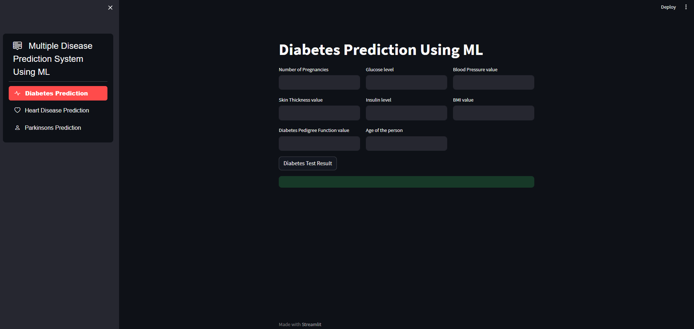

# Multiple Disease Prediction System



## Project Description

The Multiple Disease Prediction System is a machine learning-based application that aims to predict multiple diseases, including Diabetes, Heart Disease, and Parkinson's Disease. The system utilizes various machine learning algorithms to make accurate predictions based on the symptoms provided by the user.

## Table of Contents

- [Installation](#installation)
- [Usage](#usage)
- [Requirements](#requirements)
- [License](#license)

## Installation

To run this project, follow these steps:

1. Install Python (if not already installed: [Python Downloads](https://www.python.org/downloads/)).

2. Clone this repository to your local machine.

3. Open a terminal or command prompt and navigate to the project directory:

   ```bash
   cd path/to/project
   ```

## Usage
Click the link if you want to use web app.
https://web-app-multiple-disease-prediction-system-jadhrwsxjbzxhvyq4fe.streamlit.app/
When the project is run, a Streamlit application will be launched, which will be displayed in your web browser. You can then follow these steps to make disease predictions:

1. Start the Streamlit application by running the following command:

   ```bash
   streamlit run multiple_disease_pred.py
   ```

2. Use the Streamlit application in your web browser to make disease predictions. The application has a user-friendly interface, and you can enter the necessary information following the provided instructions.

## Requirements

To run this project, you will need the following Python libraries. These libraries are listed in the requirements.txt file:
You can install the required libraries
- numpy
- pandas
- scikit-learn
- streamlit
- streamlit-option-menu 

## License

This project is licensed under the MIT License. For more information, please refer to the LICENSE file.
